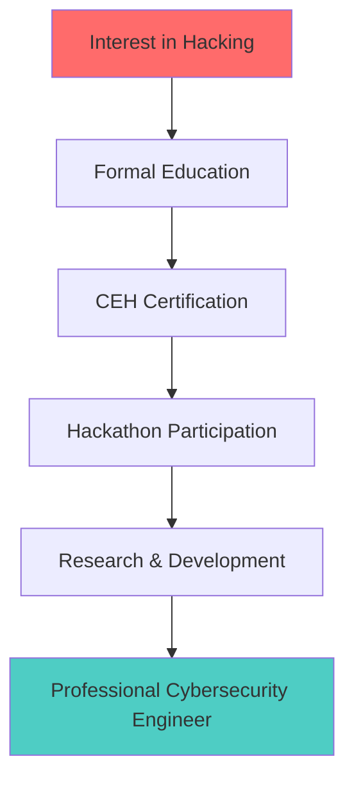

# 👨‍💻 Raju Ranjan - Cybersecurity Engineer | Ethical Hacker | Web Developer

<div align="center">

)

**"In a world of vulnerabilities, I build defenses"**

[](mailto:rajuaryan033@gmail.com)
[](https://www.linkedin.com/in/rajuranjann/)
[](https://github.com/raju4199)
[](https://tryhackme.com/p/raju4199)

</div>

---

## 🔐 **Cyber Security Specialist**

> *"To beat a hacker, you need to think like one"*

I specialize in **offensive security** and **defensive strategies** with hands-on experience in penetration testing, vulnerability assessment, and secure application development. My mission is to fortify digital infrastructures against evolving cyber threats.

---

## 🛠️ **Technical Arsenal**

### **💻 Programming & Scripting**


### **🔓 Security Tools Mastery**
<div align="center">

| **Application Testing** | **Infrastructure Testing** | **Development** | **Hobbies** |
|-------------------------|----------------------------|-----------------|-------------|
|  |  |  |  |
|  |  | |  |
|  |  | | |
| |  | | |

</div>

### **🌐 Web Development Stack**
- **Frontend**: React, Vite, HTML5, CSS3
- **Backend**: Node.js, Python
- **Database**: SQL, MongoDB
- **Security**: OWASP Top 10 Implementation

---

## 🏆 **Cyber Achievements**

<div align="center">

| **Achievement** | **Event** | **Ranking** | **Year** |
|-----------------|-----------|-------------|----------|
| 🏆 **Grand Finalist** | KAVACH Cybersecurity Hackathon | Top 3 Teams | 2023 |
| 🥇 **5th Place** | Intel OneApi Hackathon x IIT Roorkee | Top 5 | 2023 |
| 🥉 **2nd Runner-Up** | SIH 2023 Qualifiers | Top 3 | 2023 |
| ⭐ **Certified Ethical Hacker** | EC-Council CEH v12 | Certified | 2023 |
| 🔥 **TryHackMe** | Continuous Learning | Top 16% | 2024 |

</div>

---

## 💻 **Notable Projects**

### **1. 🦠 Enhanced Malware Detection using LLM**
```python
# AI-Powered Malware Analysis
- Model: Fine-tuned distilBERT
- Accuracy: 100% detection rate
- Technology: Machine Learning, Python
- Status: Research in Progress
```
> *Revolutionizing malware detection through advanced AI algorithms*

### **2. 🔌 Plug and Play Security Audit Tool**
```cpp
// Portable Security Assessment
- Platform: Cross-platform (Windows/Linux/macOS)
- Components: ATTiny85, Streamlit Dashboard
- Features: Automated system logging, vulnerability scanning
- Language: C++, Batch Scripting
```
> *Enterprise-grade security auditing made accessible*

### **3. 🌐 Web Vulnerabilities Modulation Platform**
```javascript
// Interactive Web Security Learning
- Framework: React + Vite
- Vulnerabilities: SQLi, XSS, CSRF, Broken Access Control
- Educational: Hands-on vulnerability demonstration
- Database: SQL Integration
```
> *Bridging the gap between theory and practical security*

---

## 📊 **GitHub Analytics**

<div align="center">

|  |  |
|:---:|:---:|


</div>

---

## 🐍 **Contribution Graph**

<div align="center">


</div>

---

## 📈 **Cybersecurity Journey**



---

## 🎯 **Current Focus**

- 🔬 **Research**: Advanced Malware Detection using AI/ML
- 🛡️ **Development**: Automated Security Tools
- 📚 **Learning**: Cloud Security & Blockchain Security
- 🎓 **Mentoring**: Cybersecurity Awareness Programs

---

## 📫 **Let's Collaborate**

> *"Great things in business are never done by one person. They're done by a team of people." - Steve Jobs*

I'm always open to discussing **cybersecurity projects**, **research collaborations**, or **opportunities** to make the digital world safer.

<div align="center">

[](https://raju4199.github.io)
[](https://app.hackthebox.com/profile/)
[]()

</div>

---

<div align="center">

### **⚡ "The only secure system is one that is powered off, cast in a block of concrete and sealed in a lead-lined room with armed guards."**
### **🚀 But we still need to make it work securely!**

<h1 align="center">
    
</h1>


</div>

---

*Last Updated: ${new Date().toLocaleDateString()} | ⚡ Hehe Secure first*
