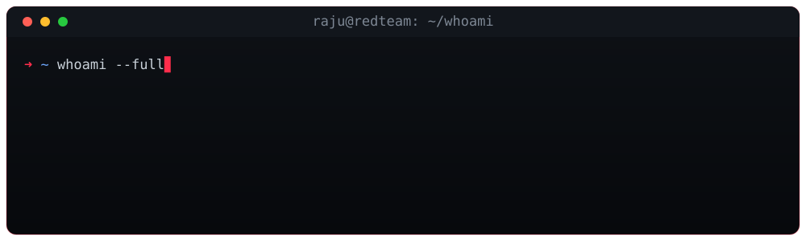
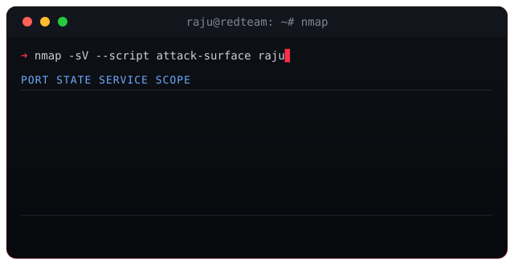
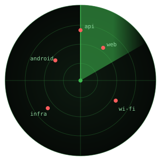
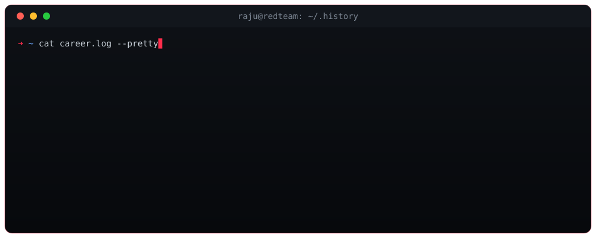
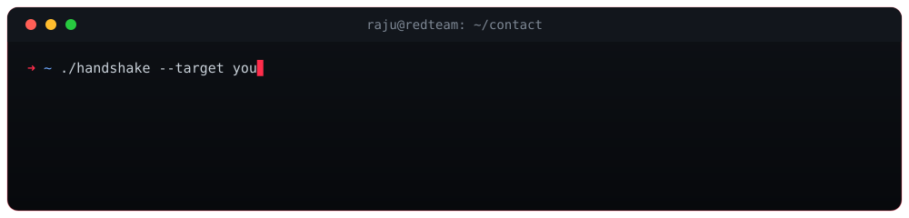

<!-- ═══════════════════════════ HEADER ═══════════════════════════ -->
<div align="center">


<br/>

[](https://raju4199.github.io)
[](https://www.linkedin.com/in/rajuranjann/)
[](https://profile.hackthebox.com/profile/019dc86e-029e-722d-af64-09ab5d5aeb0d)
[](https://tryhackme.com/p/raju4199)
[](https://medium.com/@Makishima_ShogO)
[](mailto:rajuaryan033@gmail.com)


</div>


> **I look at systems the way an attacker would, so teams can see how they break before someone else does.**
> I explore the flaws behind how things are built, and research what it takes to secure the environment around them.

<!-- ═══════════════════════════ WHOAMI ═══════════════════════════ -->
## `~$ whoami`

<div align="center">

</div>

<table>
<tr>
<td width="33%" valign="top">

### 🎯 Attacker's-eye view
Web and Android apps, Wi-Fi networks and internal infrastructure, tested the way a real adversary would: **from recon to proof of impact**.

</td>
<td width="33%" valign="top">

### 🧪 Research defenders can use
I study the building blocks defenders rely on and turn what I find into **practical guidance**, starting with a published paper on web vulnerabilities.

</td>
<td width="33%" valign="top">

### 🏆 Proven under pressure
**CEH v12**, Grand Finalist at the **KAVACH** national hackathon, and a **Gold Medal** for academic excellence.

</td>
</tr>
</table>


<!-- ═══════════════════════════ ATTACK SURFACE ═══════════════════════════ -->
## `~$ nmap -sV --script attack-surface raju`

<table border="0">
<tr>
<td width="62%" valign="middle">



</td>
<td width="38%" valign="middle" align="center">



</td>
</tr>
</table>

### ⚔️ Arsenal

<div align="center">


<br/>


</div>


<!-- ═══════════════════════════ CAREER ═══════════════════════════ -->
## `~$ cat ~/.history/career.log`

<div align="center">

</div>


<!-- ═══════════════════════════ PROJECTS ═══════════════════════════ -->
## `~$ ls -la ~/projects --featured`

<table>
<tr>
<td width="50%" valign="top">

### 🔍 [LLMScan](https://github.com/raju4199/LLM_Tools)
**The Nikto for Large Language Models.** An open-source CLI that probes any LLM endpoint for security vulnerabilities and generates a detailed report.

`Python` `AI Security` `LLM Red Teaming`

</td>
<td width="50%" valign="top">

### 📡 [BlackOps Wireless](https://github.com/raju4199/BlackOps-Wireless)
A self-contained lab for wireless security auditing: one install script and a menu-driven launcher for **Airgeddon, Wifite and Bettercap** on Kali.

`Shell` `Wi-Fi` `Kali Linux`

</td>
</tr>
<tr>
<td width="50%" valign="top">

### 🛡️ [WebSec-Suite](https://github.com/raju4199/WebSec-Suite)
A unified web security scanner that chains multiple tools into one interface, **from recon to detailed application testing**.

`Shell` `Recon` `Web Security`

</td>
<td width="50%" valign="top">

### 🌐 [Web Vulnerabilities Modulation](https://github.com/raju4199/web-vulnerabilities-modulation)
A hands-on platform simulating **SQLi, XSS and command execution** to show how attackers breach the CIA triad. Companion to my [published paper](https://www.researchgate.net/publication/380350909_Web_based_Vulnerabilities_Modulation_A_Comprehensive_Study_on_Web_Vulnerabilities).

`JavaScript` `OWASP` `Secure Dev`

</td>
</tr>
<tr>
<td width="50%" valign="top">

### 🦠 [Malware Detection using LLMs](https://github.com/raju4199/Enhanced-Malware-Detection-using-LLM-)
AI-powered malware analysis with a fine-tuned **distilBERT** model for classifying malicious samples.

`Python` `Transformers` `Malware Analysis`

</td>
<td width="50%" valign="top">

### 🧰 [Bug Bounty Toolkit](https://github.com/raju4199/bugbounty-tools-raju)
My personal collection of tooling and scripts for recon and bug hunting in web applications and APIs.

`Bug Bounty` `Recon` `Automation`

</td>
</tr>
</table>


<!-- ═══════════════════════════ ACHIEVEMENTS ═══════════════════════════ -->
## `~$ ./achievements --list`

| | Achievement | Issuer / Event | Result | Year |
|:-:|---|---|---|:-:|
| 📜 | **Published Researcher** | [ResearchGate: Web Vulnerabilities Modulation](https://www.researchgate.net/publication/380350909_Web_based_Vulnerabilities_Modulation_A_Comprehensive_Study_on_Web_Vulnerabilities) | Author | 2024 |
| 🏅 | **Academic Excellence Award** | Chandigarh University | Gold Medal, most hackathon participations | 2024 |
| 🏆 | **Grand Finalist** | KAVACH National Cybersecurity Hackathon | Top 3 teams | 2023 |
| 🥇 | **5th Place** | Intel oneAPI Hackathon × IIT Roorkee | Top 5 | 2023 |
| 🥉 | **2nd Runner-Up** | Smart India Hackathon Qualifiers | Top 3 | 2023 |
| 🎖️ | **CEH v12** | EC-Council | Certified Ethical Hacker | 2023 |


<!-- ═══════════════════════════ NOW ═══════════════════════════ -->
## `~$ cat /proc/now`

```yaml
status:     online
working_on:
  - Offensive security assessments at QOS Technology
  - Bug hunting in web applications & APIs
  - Turning research and findings into write-ups
focus:      [red-teaming, web-and-api, android, security-research]
next:
  - [ ] Advanced hands-on offensive certification
  - [ ] Follow-up research on web vulnerability patterns
  - [ ] Open-source tooling to automate my testing workflow
  - [~] Hall of fame entries through responsible disclosure
```


<!-- ═══════════════════════════ STATS ═══════════════════════════ -->
## `~$ git log --stat`

<div align="center">


<br/><br/>

<b>Intrusion Activity Log</b><br/>


</div>

<!-- ═══════════════════════════ FOOTER ═══════════════════════════ -->
## `~$ ./connect.sh`

<div align="center">



<br/><br/>


</div>
